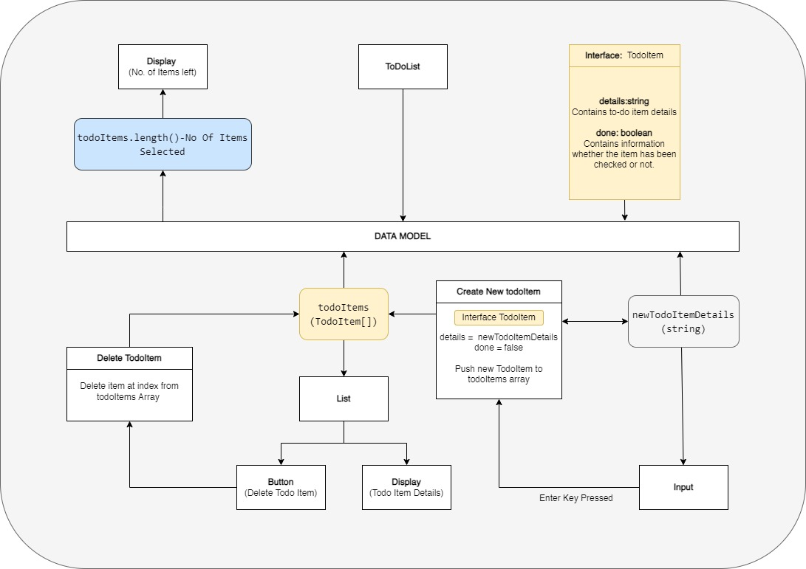

# ToDoList

The application serves as a to-do list. To-do items can be created, then later checked off once completed. The application provides feedback on the number of items that still need to be checked off the list. Any items that are not completed can be deleted if needed.

## Running the Server

Run `ng serve` for a dev server. Navigate to `http://localhost:4200/` to preview the application. 

## Application Design
I opted for the Angular Material framework, this is due to the popularity of the framework and the aesthetic of material design. The application can be broken up into three core aspects:

- User input to capture new Todo Items.
- List responsible for managing Todo Items.
- Counter to display the number of incomplete items.

I high level architectural overview of the application is shown below:

### User Input
The user input field is bound to `newTodoItemDetails`. Once the enter key is pressed, the information stored in `newTodoItemDetails` is added to a new TodoList object, and then pushed to the todoItems array. Each new TodoList object is created with the *done* boolean set to false.

### List 
The list is responsible for displaying all the items stored in the todoItems JSON array. A 2-way binding is created between the *done* boolean in each TodoItem, as well as the checkbox. This means that manually setting the boolean will set the checkbox, and setting the checkbox will set the boolean in the data. 

When the delete button on one of the list options is clicked, the index is passed to the delete function, and that element is removed from the todoItems JSON array. 

### Counter
The counter component accepts a single integer number representing the number of items that are incomplete. The number is simply displayed in the HTML to provide user feedback

## Improvements 
- Clicking on any of the Todo Item details on the list can allow the user to edit that item directly
- Add in a calendar system to schedule reminders for Todo Items.
- Add the ability to manage multiple Todo Lists
- Expand on the TodoItem Interface to store more details for each todo Item 
- Add form field validation (Disallow empty todoItems)

## Alternative Solutions 
### Pure HTML List.

The list can be managed with custom **ListManager** component. The component will contain the JSON Array  This can be achieved using `Ul and Li` elements where each option can represent a custom **OptionsComponent**.

Each OptionsComponent could consist of a checkbox, text details and a delete button. The Options component will require an EventEmitter to pass data to the parent, **ListManager**. This data could represent whether a todo record is checked or deleted.

